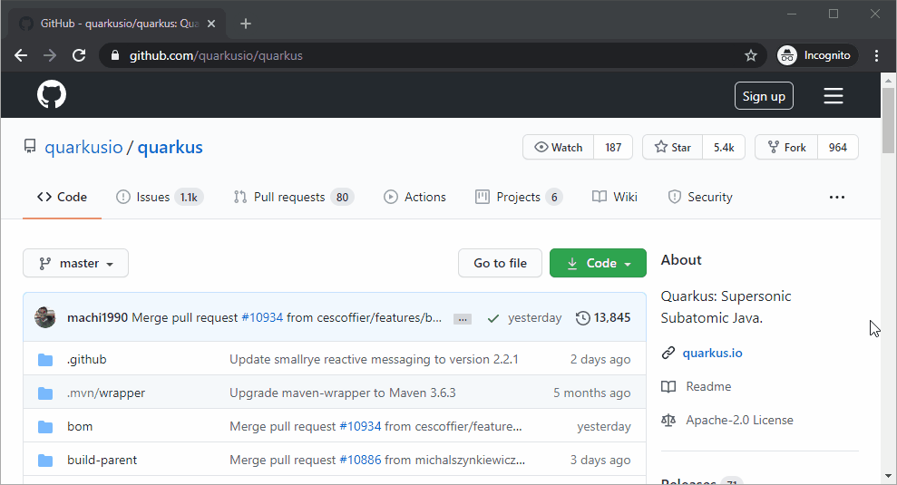

# GitHub Dependents Scraper

This tool allows you to scrape any GitHub project dependency graph for dependent projects.

<p>
    
</p>


Make sure you comply with
[GitHub Scraping and API Usage Restrictions](https://docs.github.com/en/github/site-policy/github-acceptable-use-policies#5-scraping-and-api-usage-restrictions)
before using this tool.

## Build Native Image

Setup Environment as documented in
[Quarkus:Building a native Executable](https://quarkus.io/guides/building-native-image) guide.

### \*nix
````shell script
$ mvn clean install -Pnative
````

### Windows
````shell script
$ "C:\Program Files (x86)\Microsoft Visual Studio\2017\BuildTools\VC\Auxiliary\Build\vcvars64.bat" && mvn clean install -Pnative
````

## How to run

### JVM
```shell script
$ java -jar  target/github-dependents-scraper-1.0-SNAPSHOT-runner.jar "https://github.com/fabric8io/fabric8-maven-plugin/network/dependents?package_id=UGFja2FnZS0xODEwNTMzNjE%3D"
```

### Native
- Build native executable
```shell script
$ ./target/github-dependents-scraper-1.0-SNAPSHOT-runner "https://github.com/fabric8io/fabric8-maven-plugin/network/dependents?package_id=UGFja2FnZS0xODEwNTMzNjE%3D"
```